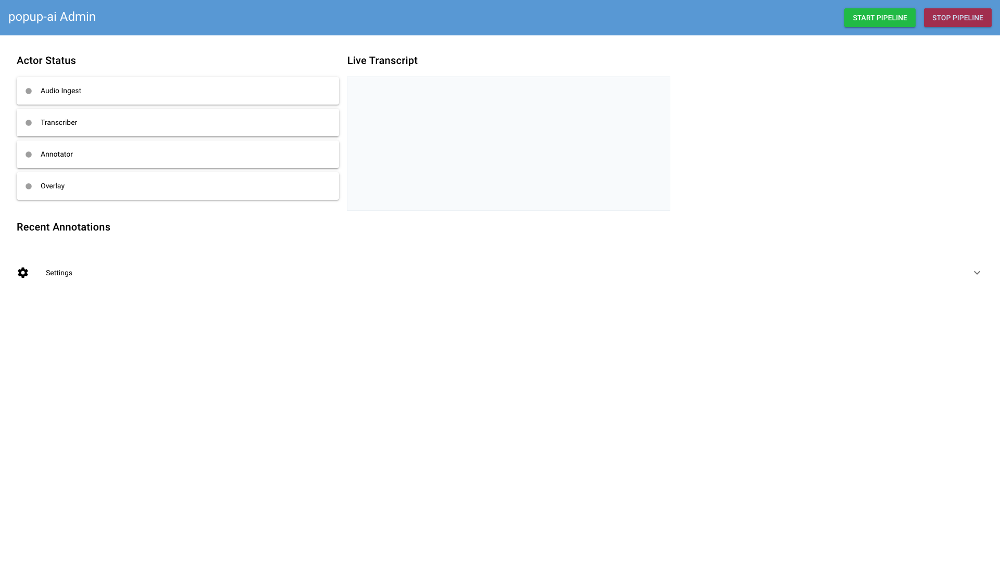

# Quickstart

Get popup-ai running and see your first annotation in about 5 minutes.

## Prerequisites

Before you begin, make sure you have:

- [x] macOS with Apple Silicon (M1/M2/M3)
- [x] Python 3.13+ (`python3 --version`)
- [x] OBS Studio installed
- [x] ffmpeg installed (`brew install ffmpeg`)
- [x] An OpenAI API key (for annotations)

## Step 1: Install popup-ai

Install popup-ai with all optional dependencies:

```bash
# Using uv (recommended)
uv pip install 'popup-ai[all]'

# Or using pip
pip install 'popup-ai[all]'
```

This installs:

- Core dependencies (Ray, Pydantic, Typer)
- UI extras (NiceGUI)
- LLM extras (pydantic-ai)
- OBS extras (obsws-python)

## Step 2: Set Your API Key

popup-ai uses pydantic-ai for LLM annotations. Set your OpenAI API key:

```bash
export OPENAI_API_KEY="your-api-key-here"
```

!!! tip "Other Providers"
    You can use other LLM providers by setting `POPUP_ANNOTATOR_PROVIDER` and `POPUP_ANNOTATOR_MODEL`. See [Configuration](../reference/configuration.md).

## Step 3: Start popup-ai

Launch the application:

```bash
uv run popup-ai
```

You should see:

```
Initializing Ray...
Starting popup-ai with UI...
```

Your browser will open to `http://127.0.0.1:8080` showing the admin UI.

{ .screenshot }

!!! note "UI Not Opening?"
    If the browser doesn't open automatically, navigate to `http://127.0.0.1:8080` manually.

## Step 4: Configure OBS for SRT

Open OBS Studio and configure it to stream audio via SRT:

1. Go to **Settings** → **Stream**
2. Set **Service** to `Custom...`
3. Set **Server** to:
   ```
   srt://localhost:9998?mode=caller&latency=200000
   ```
4. Click **Apply**

!!! info "What's Happening?"
    OBS will connect to popup-ai's SRT listener on port 9998. The `latency=200000` sets a 200ms buffer for smooth streaming.

## Step 5: Start Streaming

1. In OBS, click **Start Streaming**
2. In the popup-ai admin UI, click **Start Pipeline**

You should see:

- Actor status indicators turn green
- Transcripts appearing in the "Live Transcript" panel
- Annotations appearing in the "Recent Annotations" panel

{ .screenshot }

## Step 6: Check OBS Overlay

popup-ai creates text sources in OBS for displaying annotations:

- `popup-ai-slot-1` through `popup-ai-slot-4`

Add these sources to your scene to see annotations on stream.

## What's Next?

- [Understanding the Admin UI](admin-ui.md) - Learn all the UI features
- [Configure OBS for SRT](../how-to/configure-obs.md) - Detailed OBS setup
- [Tune Transcription](../how-to/tune-transcription.md) - Improve accuracy
- [Architecture](../explanation/architecture.md) - How it all works

## Troubleshooting

### "Connection refused" when OBS tries to stream

Make sure popup-ai is running before starting the OBS stream. The SRT listener needs to be active.

### No transcripts appearing

1. Check that OBS is actually streaming (look for bitrate in OBS status bar)
2. Verify audio is being captured (check OBS audio meters)
3. Check actor status in admin UI - look for errors

### Annotations not generating

1. Verify your `OPENAI_API_KEY` is set correctly
2. Check the annotator actor status for errors
3. Look at the terminal output for API errors
